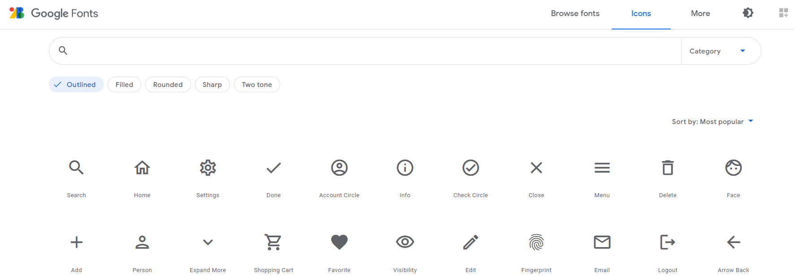
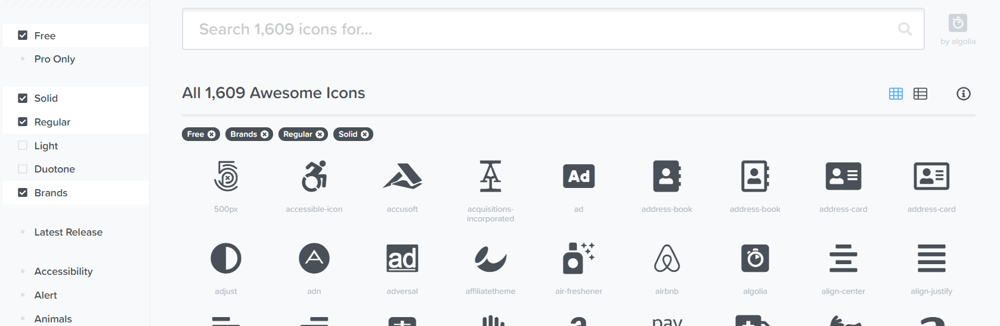
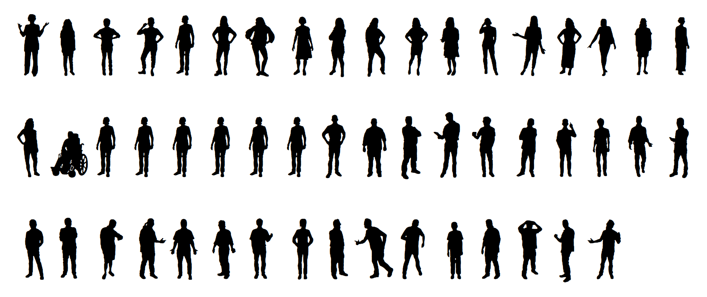

```{r setup, include=FALSE}
library(knitr)
options(shiny.useragg = TRUE)
ragg_png = function(..., res = 192) {
  ragg::agg_png(..., res = res, units = "in")
}
opts_chunk$set(
  echo = FALSE, warning = FALSE, message = FALSE,
  dev = "ragg_png", fig.ext = "png"
)
xaringanExtra::use_panelset()
```

```{r packages, include=FALSE}
library(tidyverse)
library(shiny)
library(rlang)
library(glue)
library(ggtext)
library(waffle)
```

<link rel="stylesheet" href="https://cdnjs.cloudflare.com/ajax/libs/font-awesome/4.7.0/css/font-awesome.min.css">

<style>
@import url('https://fonts.googleapis.com/css?family=Open+Sans&display=swap');
@import url('https://fonts.googleapis.com/css?family=Fira+Code&display=swap');

p, li, h1, h2, h3 {
  color: black;
  font-family: Open Sans;
}
h1, h2, h3 {
  text-decoration: underline;
}
.build {
  color: black;
}
.my-input {
  background-color: #ffff70;
  padding: 0px 5px 1px 5px;
  border-radius: 10px;
}

pre {
  font-size: 16px
  padding-left: 30px;
  margin-top: -30px;
}
pre .shiny-code {
  font-size: 18px;
  margin-top: 0px
}

/* override xaringan panelset */
ul.panel-tabs > li:before {
  content: "";
}
section.panel {
    background-color: inherit;
}
</style>

## What is an icon _font_?

<br>

> - Fonts can contain arbitrary **glyphs** (ex: Wingdings <span style='font-family: Wingdings'>RLadies</span>)

<br>

> - A **character sequence** can yield entirely different glyphs (ex: with Fira Code's code ligature `>=` `!=` `|>` becomes <span style='font-family: Fira Code'>>= != |></span>))

<br>

> - Wouldn't it be cool if we type "clock" and get an icon representing a clock?

<br>

> - In **icon fonts**, special _character sequences_ are reserved for _icon glyphs_!

---

::::: {.panelset}

::: {.panel}

[Material Icons]{.panel-name}

[Material Icons](https://fonts.google.com/icons) family by Google.

```{r material-icons, fig.align='center', out.height="300px"}

```

License: Apache 2.0 (✅ personal & commercial use)

Link to font files ([Github](https://github.com/google/material-design-icons/tree/master/font))

:::

::: {.panel}

[Font Awesome]{.panel-name}

[Font Awesome 5 Free](https://fontawesome.com/icons?d=gallery&p=2&s=brands,regular,solid&m=free) family with >1500 icons.

```{r font-awesome, fig.align='center', out.height="300px"}

```

License: CC BY (✅ personal & commercial use; 💲paid version w/ more icons)

Link to font files ([Github](https://github.com/FortAwesome/Font-Awesome/tree/master/otfs))

:::

::: {.panel}

[Wee People]{.panel-name}

[Wee People](https://github.com/propublica/weepeople) font by Albert Cairo (ProPublica)

```{r weepeople, fig.align='center', out.height="300px"}

```

License: CC BY-NC-ND (❌ commercial use)

Link to font files ([Github](https://github.com/propublica/weepeople))

:::

::::

## Why icon fonts (vs. icon images?)?

<br>

> - Small size (~ a couple hundred kilobytes)

<br>

> - Scalable (consistent resolution)

<br>

> - Standardized (within a family)

<br>

> - Treated as text


---

```{r ui}
fluidRow(
  column(4, textInput("text", label = "Text", value = '"Hello!"')),
  column(6, textInput("code", label = "Miscellaneous aesthetics", value = "size = 25")),
  column(2, actionButton("renderPlot", label = "Render Plot"))
)
```

```{r server}
plot_expr <- reactive({glue("
    ggplot(NULL, aes(0, 0, label = {input$text})) + theme_classic() +
      geom_text({input$code})
  ")})

plot_text <- reactive({
  tags$pre(
    HTML(paste0("
    ggplot(NULL, aes(0, 0, label = ", tags$strong(input$text, class = "my-input"), ")) + theme_classic() +
      geom_text(", tags$strong(input$code, class = "my-input"), ")"
    )),
    style = "background-color: #f3f3f3;"
  , class = "shiny-code")
})

renderUI(plot_text())

plot_parsed <- eventReactive(input$renderPlot, eval(parse_expr(plot_expr())))

renderPlot(plot_parsed(), res = 150)
```

# Spicing up your labels

```{r theme, echo = FALSE}
# devtools::install_github('yjunechoe/junebug')
theme_set(theme_classic())
theme_update(
  axis.text = element_text(size = 12, color = "black"),
  plot.background = element_rect(fill = NA, color = "black"),
  plot.title = element_text(size = 18, family = "Alegreya")
)
```

## Bar plot

```{r}
bar_labels_df <- tribble(
  ~ platform, ~ familiarity, ~ color,
  "twitter", 0.8, "#00A9E9",
  "instagram", 0.2, "#C72584",
  "facebook", 0.4, "#0071FD"
)

bar_plot <- ggplot(bar_labels_df, aes(platform, familiarity)) +
  geom_col(
    aes(fill = color),
    width = .7
  ) +
  scale_fill_identity() +
  scale_color_identity() +
  labs(
    title = "My familiarity-level with social media platforms",
    x = NULL, y = NULL
  ) +
  theme(
    axis.line.y = element_blank(),
    axis.text.y = element_blank(),
    axis.ticks.y = element_blank()
  )

bar_plot
```


## Bar labels

```{r, eval = FALSE, echo = TRUE}
geom_text(..., family = "Font Awesome 5 Brands")
```

```{r, bar-labels}
bar_labels_plot <- bar_plot +
  geom_text(                                          #< Set `platform` variable
    aes(label = platform, color = color),             #< as the label and render
    size = 18, position = position_nudge(y = 0.15),   #< with the "Font Awesome 5
    family = "Font Awesome 5 Brands"                  #< Brands" font.
  ) +
  scale_y_continuous(expand = expansion(c(0, .15))) 

bar_labels_plot
```

## Axis labels

```{r, eval = FALSE, echo = TRUE}
theme(axis.text.x = element_text(family = "Font Awesome 5 Brands"))
```

```{r}
bar_labels_plot +
  theme(axis.text.x = element_text(family = "Font Awesome 5 Brands"))
```

## Axis labels (colored)

```{r, eval = FALSE, echo = TRUE}
scale_x_discrete(labels = function(x) {glue("<span style='color: {brand_palette[x]}'>{x}</span>")}) +
  theme(axis.text.x = element_markdown(family = "Font Awesome 5 Brands"))
```


```{r}
brand_palette <- bar_labels_df %>% 
  pull(color, platform)

# > brand_palette
#   twitter   instagram  facebook 
#   "#00A9E9" "#C72584"  "#0071FD" 

bar_labels_plot +
  scale_x_discrete(labels = function(x) {glue("<span style='color: {brand_palette[x]}'>{x}</span>")}) +
  theme(axis.text.x = ggtext::element_markdown(family = "Font Awesome 5 Brands"))
```

## In-line icon

```{r, eval = FALSE, echo = TRUE}
labs(title = ...) + theme(plot.title = ggtext::element_markdown())
```

```{r}
bar_labels_plot +
  labs(title = "I'm more familiar with <span style='font-family: \"Font Awesome 5 Brands\"; color:#00A9E9; font-size: 18px;'>twitter</span> than <span style='font-family: \"Font Awesome 5 Brands\"; color:#C72584; font-size: 20px;'>instagram</span>") +
  scale_x_discrete(labels = function(x) {glue("<span style='color: {brand_palette[x]}'>{x}</span>")}) +
  theme(
    axis.text.x = ggtext::element_markdown(family = "Font Awesome 5 Brands"),
    plot.title = ggtext::element_markdown()
  )
```

# Unlocking new charts!

```{r}
# devtools::install_github("yjunechoe/junebug")
junebug::font_hoist("Font Awesome 5 Free") 
```


## Weather forecast

```{r}
forecast <- tribble(
  ~day, ~temp, ~weather,
  "Mon", 23.3, "cloud-showers-heavy",
  "Tue", 25.2, "cloud-sun-rain",
  "Wed", 24.5, "cloud-sun-rain",
  "Thu", 27.8, "cloud-sun",
  "Fri", 28.7, "cloud",
  "Sat", 29.3, "sun",
  "Sun", 29.1, "sun",
) %>% 
  mutate(day = fct_inorder(day))

ggplot(forecast) +
  geom_text(
    aes(day, temp, label = weather),
    size = 15, family = "Font Awesome 5 Free Solid"
  ) +
  scale_y_continuous(
    label = function(x) {paste0(x, "°C")},
    expand = expansion(add = 2)
  ) +
  labs(x = NULL, y = NULL) +
  theme(
    axis.ticks.x = element_blank(),
    axis.title.x = element_blank()
  )
  

```

## Waffle chart

```{r}
crossing(
  col = 1:8,
  row = 1:4
) %>%
  arrange(col, desc(row)) %>% 
  slice(1:(n() - 2)) %>% 
  mutate(
    brand = c(rep("twitter", 14), rep("instagram", 9), rep("facebook", 7)),
    color = brand_palette[brand]
  ) %>% 
  ggplot(aes(col, row, label = brand, color = color)) +
  geom_text(size = 14, family = "Font Awesome 5 Brands") +
  scale_color_identity() +
  scale_x_continuous(expand = expansion(add = 1)) +
  scale_y_continuous(expand = expansion(add = 1)) +
  theme_void()

```

## Infographic

```{r}
set.seed(2021)

ggplot(NULL) +
  geom_rect(
    aes(xmin = 0.5, xmax = 6.5, ymin = 0:2 - 0.4, ymax = 0:2 + 0.4),
    color = "darkgrey", fill = NA
  ) +
  geom_text(
    aes(x = 1:4 * 1.4, y = 0, label = "car-side"),
    size = 8,
    family = "Font Awesome 5 Free Solid"
  ) +
  geom_text(
    aes(x = rep(c(3:18)/3, each = 2), y = 1, label = "directions_bike"),
    position = position_nudge(y = c(-.2, 0.2)),
    size = 6, family = "Material Icons"
  ) +
  geom_text(
    aes(x = rep(c(2:12)/2, each = 10), y = 2, label = sample(c(letters, LETTERS), 110, replace = TRUE)),
    position = position_jitter(width = .3, height = 0.2),
    size = 10, family = "WeePeople"
  ) +
  geom_text(
    aes(x = 7.5, y = 0:2, label = paste(c(8, 32, 110), "people")),
    fontface = "bold", size = 5
  ) +
  scale_x_continuous(expand = expansion(add = 1)) +
  scale_y_continuous(expand = expansion(add = 0.5)) +
  theme_void()
```

## ... and much more!

For a fuller experience with icon fonts, check out:

<br>

```{r, eval = FALSE, echo = TRUE}
library(ggfx)
library(gggrid) # devtools::install_github("pmur002/gggrid")
library(ggfittext)
library(ggrepel)
library(systemfonts)
library(textshaping)
library(string2path) # devtools::install_github("yutannihilation/string2path")
library(shadowtext)
```

<br>

For installing and debugging custom fonts in R:

- Rstudio blog posts ([1](https://www.tidyverse.org/blog/2021/02/modern-text-features/), [2](https://www.tidyverse.org/blog/2020/05/updates-to-ragg-and-systemfonts/)), [twitter thread](https://twitter.com/yjunechoe/status/1382747651075100676)
